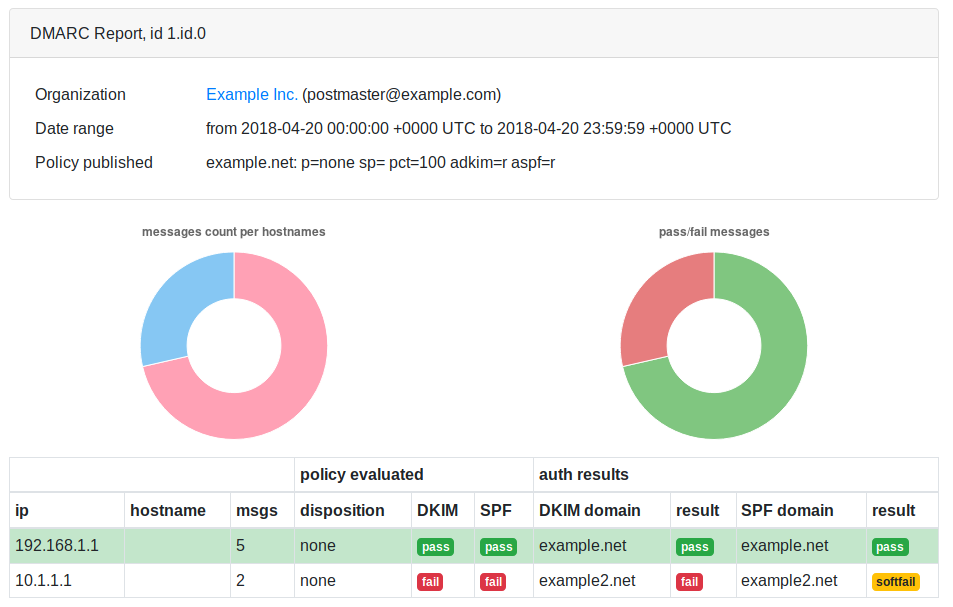

dmarc-report-converter
======================

Convert DMARC reports from xml to human-readable formats.

Example of html output:


Support inputs:

* **.xml** file: dmarc report in xml format

* **.gz** file: gzipped dmarc report in xml format

* **.zip** file: zipped dmarc report in xml format

* **imap**: connect to imap server and download emails. If attachments contains **.xml**, **.gz** or
  **.zip**, try to convert them

Support output formats:

* **html** output file is the html, generated from template templates/html.gotmpl

* **txt** output file is the plain text, generated from template templates/txt.gotmpl

* **json** output file is the json

Configuration
-------------

Copy config/config.dist.yaml to config.yaml and change parameters:

* input: choose and configure **dir** OR **imap**. If **delete: yes**, delete source
  files after converting (with configured imap, delete source emails)

* output: choose format and file name template. If **file** empty string "" or "stdout", print
  result to stdout.

* lookup_addr: perform reverse lookup? If enabled, may take some time.

Installation
------------

```bash
go get -u https://github.com/tierpod/dmarc-report-converter.git
cd dmarc-report-converter
make bin/dmarc-report-converter
# install bin/dmarc-report-converter executable to /opt/dmarc-report-converter, and cron job to /etc/cron.daily
sudo make install
# edit /opt/dmarc-report-converter/ config.yaml and templates/*.gotmpl if needed
# put html assets to your web server
# add to crontab daily job: /etc/cron.daily/dmarc-report-converter
```
